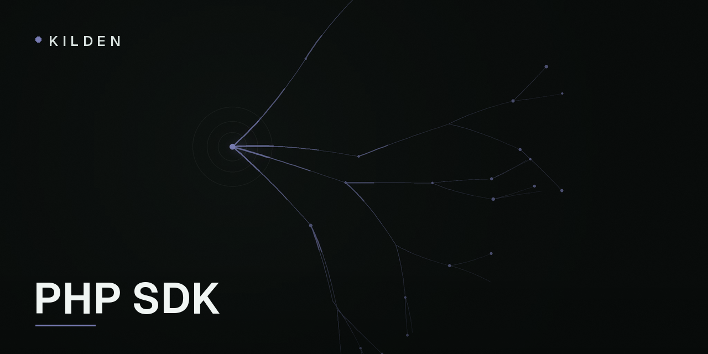

<p align="center">
  
</p>

# Kilden PHP SDK

[](https://packagist.org/packages/kilden/kilden-php)
[](https://github.com/kildenhq/kilden-sdk-php/actions/workflows/ci.yml)
[](LICENSE)

Server-side PHP SDK for [Kilden](https://kilden.io), the open customer data
platform: events, identity verification and feature flags from your backend.
PHP 7.4+, zero dependencies — it runs on the shared hosting your WordPress
client lives on and on your Laravel 13 app alike.

```sh
composer require kilden/kilden-php:@alpha
# (the @alpha flag goes away at 0.1.0)
```

```php
$kilden = new Kilden\Client('sk_your_secret_key');

$kilden->track('user_42', 'order_completed', [
    'revenue' => 99.9,
    'currency' => 'CLP',
]);
```

That is a complete, working integration: events queue in memory and flush in
batches (20 events or 10 seconds, whichever comes first), with gzip, retries
with backoff, and a shutdown hook that delivers whatever is left after your
response is sent — under FPM it runs after `fastcgi_finish_request()`, so
telemetry never adds latency your user can feel.

**Use the secret key (`sk_`), never the public one.** Events sent with the
secret key are `source=server`, `verified=true` — facts your campaigns and
revenue reports can trust. The constructor rejects public (`wk_`) keys
outright. Keep the secret key out of browsers, mobile apps, and frontend
bundles of any kind.

## Identity verification

Anyone can open a browser console and send events as `user_id=ceo@corp` —
unless you turn on identity verification. Your backend signs a short-lived
token vouching for the logged-in user; Kilden's web SDK attaches it, and the
platform marks those events verified. Signing is the part only your backend
can do, and it is three lines:

```php
$signer = new Kilden\IdentitySigner($_ENV['KILDEN_IDENTITY_SECRET'], ['kid' => 'k1']);

$token = $signer->sign($user->id, [
    'ttl'    => 3600,
    'traits' => ['plan' => $user->plan],   // signed traits override unsigned ones
]);
```

**Only sign a `sub` your backend authenticated.** Signing request input —
`$signer->sign($_POST['user_id'])` — lets anyone impersonate anyone, with a
"verified" stamp on top. Sign `$user->id` after your auth layer resolved it,
never before.

Traits passed to `sign()` become *signed traits*: during enrichment they win
over any unsigned traits the browser claims for the same event.

## Feature flags

```php
if ($kilden->isEnabled('new_checkout', 'user_42')) {
    // ...
}

$variant = $kilden->getFeatureFlag('pricing_test', 'user_42', [
    'person_properties' => ['plan' => 'pro'],  // evaluated server-side, this call only
    'default'           => false,              // returned if Kilden is unreachable
]);
```

`getFeatureFlag` returns `false`, `true`, or the variant key as a string.
Evaluation is remote against `/decide` with a 30-second in-memory cache per
`distinct_id`; calls with `person_properties` bypass the cache. When Kilden
cannot answer within `timeout` (default 3s), you get your `default` back —
one attempt, no retries, your request never blocks on a flag.

## Batching, flush and shutdown

Events do not hit the network on every `track()`. They queue in memory and
flush when the queue reaches `flush_at` (default 20), when `flush_interval`
elapses on a long-running process, or when you say so:

```php
$kilden->flush();   // blocking: drain everything queued right now
$kilden->close();   // flush with a 10s deadline, then refuse further events
```

Call `close()` at the end of CLI scripts and workers. Under FPM you can skip
it: a `register_shutdown_function` hook flushes after the response is handed
off. If the process dies before any flush path runs (`kill -9`, fatal at the
wrong instant), queued events are lost — that is the documented trade-off of
in-memory batching; anything stricter needs a persistent queue on your side.

The queue is bounded (`max_queue_size`, default 10 000). When full, the
newest event is dropped and counted; `$kilden->droppedCount()` tells you how
many events were lost to a full queue, invalid input or exhausted retries.

## Options

```php
$kilden = new Kilden\Client('sk_...', [
    'host'            => 'https://ingest.kilden.io',
    'flush_at'        => 20,
    'flush_interval'  => 10,
    'max_queue_size'  => 10000,
    'timeout'         => 3,
    'transport'       => null,     // autodetect: curl, then stream wrappers
    'debug'           => false,
    'enabled'         => true,     // false = full no-op for tests and local dev
]);
```

The constructor throws on misconfiguration (missing key, public key, no
transport available) — fail at boot, not at 3am. After construction the SDK
never throws: invalid input is dropped and logged, and delivery failures
degrade to dropped batches, never to exceptions in your request path.

No `ext-curl`? The SDK falls back to stream wrappers automatically, and you
can inject any `Kilden\Transport\Transport` implementation (that is how the
WordPress plugin routes through `wp_remote_post()`).

## Laravel

The [`kilden/laravel`](packages/laravel) package wraps this SDK for Laravel
11–13: config file, `Kilden` facade, queued delivery, and the
`POST /kilden/identity` endpoint the web SDK refreshes its tokens against.

```php
// config/kilden.php via: php artisan vendor:publish --tag=kilden-config
Kilden::track($user->id, 'subscription_started', ['plan' => 'pro']);

// routes/web.php — one line, behind your auth middleware:
KildenRoutes::identity();
```

With `KILDEN_QUEUE=true`, event calls dispatch a Horizon/queue job instead of
sending inline. `Kilden::fake()` gives you a spy with `assertTracked()` for
your test suite.

## Spec

This SDK implements the
[Kilden server SDK specification](https://github.com/kildenhq/kilden-sdk-spec)
(spec version 0.1) and runs its frozen test vectors — including byte-exact
identity token signatures — against the shared mock capture server in CI.
Behavior changes land in the spec first, then here.

## Community

- [Documentation](https://kilden.io/docs)
- [Discussions](https://github.com/kildenhq/kilden-sdk-php/discussions)

## License

[MIT](LICENSE)
